# Référence CLI

Toutes les commandes anklume. La CLI est la seule interface — pas de
Makefile, pas d'API web.

## Workflow principal

| Commande | Description |
|---|---|
| `anklume init [dir]` | Créer un nouveau projet |
| `anklume apply all` | Déployer toute l'infrastructure |
| `anklume apply all --dry-run` | Afficher les changements sans appliquer |
| `anklume apply all --no-provision` | Déployer sans provisioning Ansible |
| `anklume apply domain <nom>` | Déployer un seul domaine |
| `anklume status` | Afficher l'état des instances |
| `anklume destroy` | Détruire (respecte la protection ephemeral) |
| `anklume destroy --force` | Tout détruire |

## Gestion des instances

| Commande | Description |
|---|---|
| `anklume instance list` | Tableau des instances (nom, domaine, état, IP, type) |
| `anklume instance exec <inst> -- <cmd>` | Exécuter dans une instance |
| `anklume instance info <inst>` | Détails d'une instance |
| `anklume instance clipboard --push` | Copier le presse-papiers hôte → conteneur |
| `anklume instance clipboard --pull` | Copier le presse-papiers conteneur → hôte |

## Gestion des domaines

| Commande | Description |
|---|---|
| `anklume domain list` | Tableau des domaines |
| `anklume domain check <nom>` | Valider un domaine isolément |
| `anklume domain exec <nom> -- <cmd>` | Exécuter dans toutes les instances |
| `anklume domain status <nom>` | État détaillé d'un domaine |

## Snapshots

| Commande | Description |
|---|---|
| `anklume snapshot create [instance]` | Snapshotter toutes ou une seule instance |
| `anklume snapshot create --name X` | Snapshot avec nom personnalisé |
| `anklume snapshot list [instance]` | Lister les snapshots |
| `anklume snapshot restore <inst> <snap>` | Restaurer un snapshot |
| `anklume snapshot delete <inst> <snap>` | Supprimer un snapshot |
| `anklume snapshot rollback <inst> <snap>` | Rollback destructif |

## Réseau

| Commande | Description |
|---|---|
| `anklume network rules` | Générer les règles nftables (stdout) |
| `anklume network deploy` | Appliquer les règles sur l'hôte |
| `anklume network status` | État réseau (bridges, IPs, nftables) |

## IA et LLM

| Commande | Description |
|---|---|
| `anklume ai status` | État des services IA (GPU, Ollama, STT) |
| `anklume ai flush` | Décharger les modèles Ollama, libérer la VRAM |
| `anklume ai switch <domaine>` | Basculer l'accès exclusif GPU |
| `anklume llm status` | Vue dédiée backends LLM |
| `anklume llm bench` | Benchmark inférence (tokens/s, latence) |
| `anklume llm sanitize <texte>` | Dry-run sanitisation |

## Portails et transferts

| Commande | Description |
|---|---|
| `anklume portal push <inst> <src> <dst>` | Envoyer un fichier vers un conteneur |
| `anklume portal pull <inst> <src> <dst>` | Récupérer un fichier depuis un conteneur |
| `anklume portal list <inst> [path]` | Lister les fichiers d'un conteneur |

## Conteneurs jetables

| Commande | Description |
|---|---|
| `anklume disp <image>` | Lancer un conteneur jetable |
| `anklume disp --list` | Lister les conteneurs jetables |
| `anklume disp --cleanup` | Supprimer tous les conteneurs jetables |

## Opérations avancées

| Commande | Description |
|---|---|
| `anklume golden create <inst> [--alias X]` | Publier une instance comme image |
| `anklume golden list` | Lister les golden images |
| `anklume golden delete <alias>` | Supprimer une golden image |
| `anklume console [domaine]` | Console tmux colorée par domaine |
| `anklume doctor` | Diagnostic automatique |
| `anklume doctor --fix` | Diagnostic + corrections automatiques |
| `anklume setup import [--dir]` | Importer une infrastructure Incus existante |

## STT (Speech-to-Text)

| Commande | Description |
|---|---|
| `anklume stt setup` | Configurer le push-to-talk |
| `anklume stt start` | Démarrer le push-to-talk |
| `anklume stt stop` | Arrêter le push-to-talk |
| `anklume stt status` | État du service STT |

## Éditeur TUI

| Commande | Description |
|---|---|
| `anklume tui` | Éditeur interactif de domaines et politiques |
| `anklume tui --project <dir>` | Éditeur sur un projet spécifique |

## Développement

| Commande | Description |
|---|---|
| `anklume dev setup` | Préparer l'environnement de dev |
| `anklume dev lint` | Tous les validateurs (ruff) |
| `anklume dev test` | pytest + behave |
| `anklume dev molecule` | Tests Molecule (rôles Ansible) |
| `anklume dev env <name>` | Générer un domaine de développement |
| `anklume dev test-real` | Tests E2E dans une VM KVM |

## Télémétrie

| Commande | Description |
|---|---|
| `anklume telemetry on` | Activer la télémétrie (opt-in) |
| `anklume telemetry off` | Désactiver la télémétrie |
| `anklume telemetry status` | État de la télémétrie |

## Arbre des commandes

```mermaid
graph TD
    CLI[anklume]
    CLI --> init
    CLI --> apply
    CLI --> status
    CLI --> destroy
    CLI --> instance
    CLI --> domain
    CLI --> snapshot
    CLI --> network
    CLI --> ai
    CLI --> llm
    CLI --> portal
    CLI --> disp
    CLI --> golden
    CLI --> console
    CLI --> doctor
    CLI --> stt
    CLI --> dev
    CLI --> setup
    CLI --> tui
    CLI --> telemetry

    apply --> apply_all[all]
    apply --> apply_domain[domain]
    instance --> inst_list[list]
    instance --> inst_exec[exec]
    instance --> inst_info[info]
    instance --> inst_clip[clipboard]
    domain --> dom_list[list]
    domain --> dom_check[check]
    domain --> dom_exec[exec]
    domain --> dom_status[status]
    snapshot --> snap_create[create]
    snapshot --> snap_list[list]
    snapshot --> snap_restore[restore]
    snapshot --> snap_delete[delete]
    snapshot --> snap_rollback[rollback]

    style CLI fill:#6366f1,color:#fff
```

