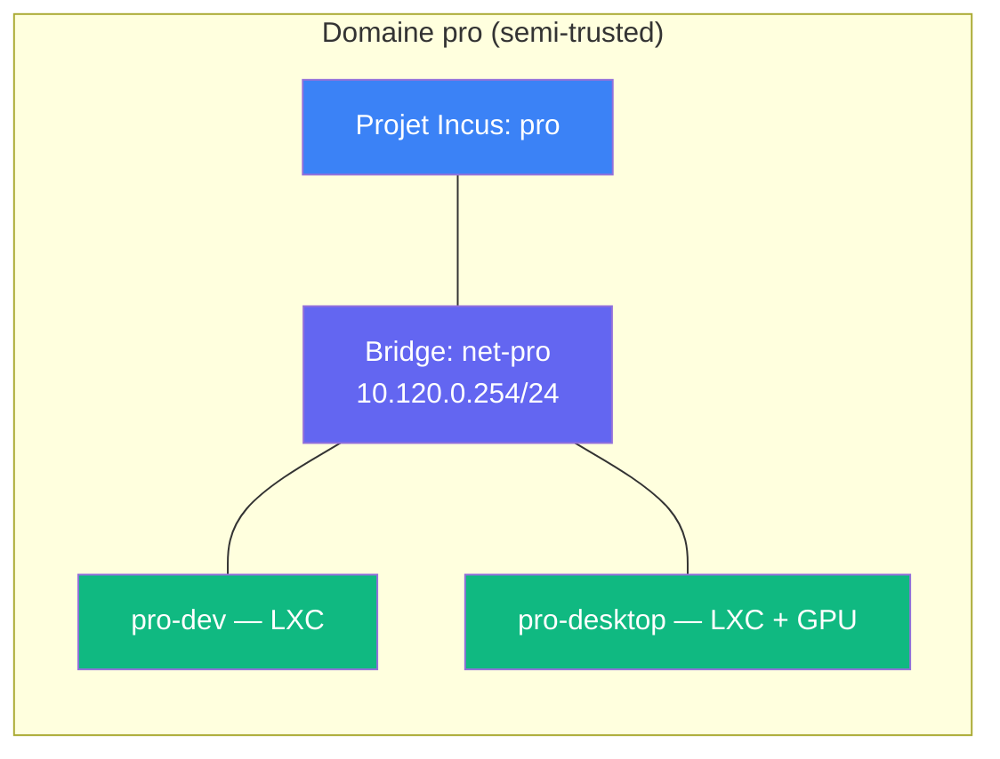

# Domaines et machines

## Domaine

Un domaine est une **zone isolée** comprenant :

- Un **projet Incus** dédié
- Un **sous-réseau** avec bridge
- Des **instances** (conteneurs LXC ou VMs KVM)
- Un **niveau de confiance** (trust level)

Chaque domaine est décrit dans son propre fichier `domains/<nom>.yml`.



## Machine (instance)

Une machine est un conteneur LXC ou une VM KVM à l'intérieur d'un domaine.

### Nommage automatique

Le nom court dans le fichier domaine est auto-préfixé par le nom du
domaine :

| Fichier | Nom court | Nom Incus |
|---|---|---|
| `domains/pro.yml` | `dev` | `pro-dev` |
| `domains/ai-tools.yml` | `gpu-server` | `ai-tools-gpu-server` |

Les noms complets sont globalement uniques.

### Champs machine

| Champ | Défaut | Description |
|---|---|---|
| `description` | requis | À quoi sert cette machine |
| `type` | `lxc` | `lxc` ou `vm` |
| `ip` | auto | Auto-assigné depuis le sous-réseau |
| `gpu` | `false` | Passthrough GPU |
| `roles` | `[]` | Rôles Ansible pour le provisioning |
| `config` | `{}` | Config Incus (overrides) |
| `persistent` | `{}` | Volumes persistants (`nom: chemin`) |
| `vars` | `{}` | Variables Ansible |
| `weight` | `1` | Poids pour l'allocation de ressources |
| `ephemeral` | hérité | Hérite du domaine |

### LXC vs VM

| | LXC | VM |
|---|---|---|
| **Isolation** | Partage le noyau hôte | Noyau dédié (KVM) |
| **Performance** | Quasi-native | Légère surcharge |
| **Démarrage** | < 1 seconde | ~10 secondes |
| **Usage** | Majorité des cas | GPU, noyau custom, sécurité maximale |

## Profils

Configuration Incus réutilisable, définie au niveau du domaine :

```yaml
profiles:
  gpu-passthrough:
    devices:
      gpu:
        type: gpu
```

Les machines référencent les profils de leur domaine via `profiles: [default, gpu-passthrough]`.
