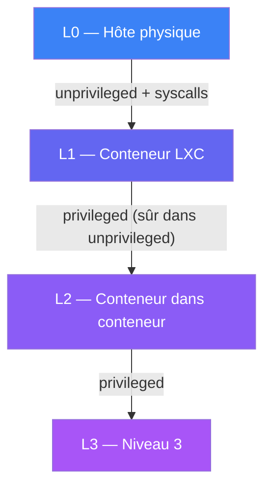
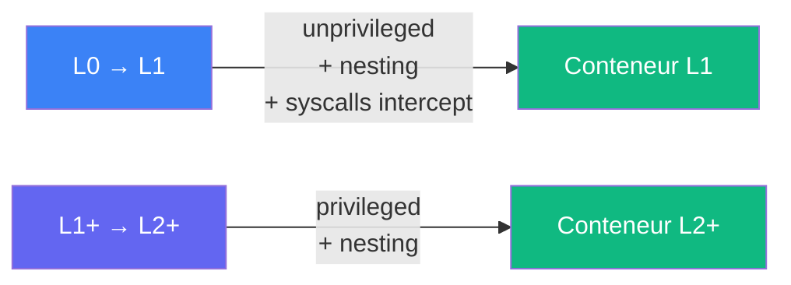

# Nesting Incus

Support du nesting LXC pour les architectures multi-niveaux :
conteneurs dans conteneurs, jusqu'à 5 niveaux validés.

## Principe



## Contexte de nesting

Au démarrage, anklume détecte son niveau dans la hiérarchie via les
fichiers `/etc/anklume/` :

| Fichier | Description | Exemple L1 |
|---|---|---|
| `absolute_level` | Profondeur absolue (0 = hôte) | `1` |
| `relative_level` | Reset à 0 après frontière VM | `1` |
| `vm_nested` | VM dans la chaîne d'ancêtres | `false` |
| `yolo` | Override des checks de sécurité | `false` |

## Préfixe de nesting

Quand `nesting.prefix: true` (défaut) et `absolute_level > 0`, les
ressources Incus sont préfixées pour éviter les collisions :

| Ressource | Hôte (L0) | Niveau 1 | Niveau 2 |
|---|---|---|---|
| Projet | `pro` | `001-pro` | `002-pro` |
| Bridge | `net-pro` | `001-net-pro` | `002-net-pro` |
| Instance | `pro-dev` | `001-pro-dev` | `002-pro-dev` |

Format : `{level:03d}-`

À L0, aucun préfixe — il sert uniquement aux niveaux imbriqués.

## Sécurité par niveau



| Niveau courant | Configuration des instances créées |
|---|---|
| L0 (hôte) | `security.nesting=true`, `security.syscalls.intercept.mknod=true`, `security.syscalls.intercept.setxattr=true` |
| L1+ (conteneur) | `security.nesting=true`, `security.privileged=true` |

L2+ : conteneurs privilegiés à l'intérieur de conteneurs unprivileged —
sûr par design (recommandation stgraber).

## Fichiers de contexte

Chaque instance créée reçoit 4 fichiers dans `/etc/anklume/` pour que
le prochain niveau puisse détecter son contexte. L'injection est
best-effort (continue si l'instance refuse les commandes).

## Configuration

```yaml
# anklume.yml
nesting:
  prefix: true    # préfixer les ressources par niveau (défaut)
```
