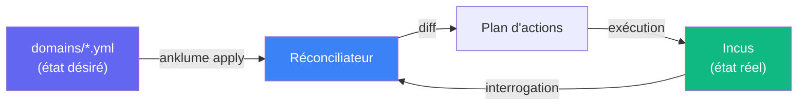
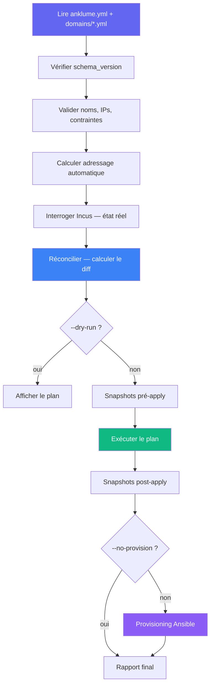

# Modèle PSOT — Source de vérité stateless

PSOT = **Primary Source of Truth**. Les fichiers `domains/*.yml` sont
la source de vérité primaire. Incus est la source de vérité secondaire
(état réel).

## Principe



- **Pas de state file** — le système est stateless par design
- **Idempotent** — relancer `apply` produit le même résultat
- **Git-friendly** — les fichiers domaine sont commités dans git

## Pipeline `anklume apply`



## Réconciliation

Le réconciliateur compare l'état désiré avec l'état réel et produit
un plan d'actions ordonnées :

1. Créer les projets Incus manquants
2. Créer les réseaux (bridges) manquants
3. Créer les instances manquantes
4. Démarrer les instances arrêtées

### Actions

| Verbe | Ressource | Quand |
|---|---|---|
| `create` | projet, réseau, instance | Manquant dans Incus |
| `start` | instance | Existe mais arrêtée |
| `skip` | tout | Déjà dans l'état voulu |

### Best-effort

En cas d'échec partiel (domaine 3/5 échoue) :

- Les domaines indépendants continuent
- Le rapport final indique les succès et échecs
- Un `apply` suivant reprend depuis l'état réel (idempotent)

## Dry-run

```bash
anklume apply all --dry-run
```

Affiche le plan sans l'exécuter :

```
[dry-run] Domaine pro :
  + Créer projet : pro
  + Créer réseau : net-pro (10.120.0.254/24)
  + Créer instance : pro-dev (lxc, images:debian/13)
  + Démarrer instance : pro-dev
```
