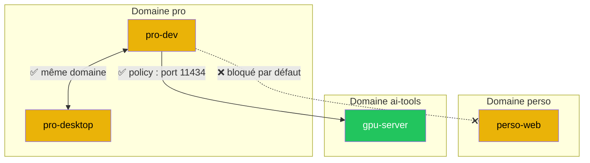
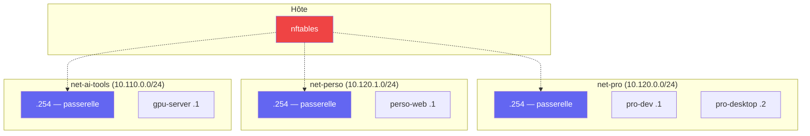

# Réseau et isolation

## Isolation par défaut

Tout le trafic inter-domaines est **bloqué par défaut** via nftables.
Les exceptions sont déclarées explicitement dans `policies.yml`.



## Architecture réseau

Chaque domaine obtient son propre bridge réseau :



## Politiques réseau

Les exceptions au blocage par défaut sont déclarées dans `policies.yml` :

```yaml
policies:
  - from: pro
    to: ai-tools
    ports: [11434, 3000]
    description: "Pro accède à Ollama et Open WebUI"

  - from: host
    to: shared-dns
    ports: [53]
    protocol: udp
    bidirectional: false
    description: "DNS local"
```

### Champs

| Champ | Défaut | Description |
|---|---|---|
| `from` | requis | Domaine, machine, ou `host` |
| `to` | requis | Domaine ou machine |
| `ports` | requis | Liste de ports ou `all` |
| `protocol` | `tcp` | `tcp` ou `udp` |
| `bidirectional` | `false` | Qui peut initier la connexion |
| `description` | requis | Justification de la politique |

### Bidirectional

- `false` (défaut) — seul `from` peut initier vers `to`
- `true` — les deux parties peuvent initier la connexion

## Commandes réseau

```bash
# Générer les règles nftables (stdout)
anklume network rules

# Appliquer les règles sur l'hôte
anklume network deploy

# État réseau (bridges, IPs, nftables actives)
anklume network status
```

## Génération nftables

anklume génère un ruleset nftables complet :

1. **Drop-all** — tout le trafic inter-domaines est bloqué
2. **Allow sélectif** — une règle par politique déclarée
3. Les cibles sont résolues : domaine → bridge, machine → bridge + IP
