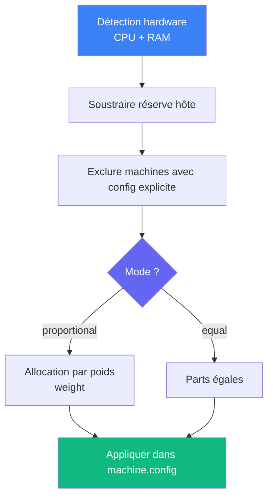

# Resource policy

Allocation automatique des ressources CPU et mémoire aux instances.

## Configuration

```yaml
# anklume.yml
resource_policy:
  host_reserve:
    cpu: "20%"            # Réserve hôte
    memory: "20%"
  mode: proportional      # proportional ou equal
  cpu_mode: allowance     # allowance (%) ou count (vCPUs)
  memory_enforce: soft    # soft (ballooning) ou hard (limite stricte)
  overcommit: false       # true = warning au lieu d'erreur
```

## Algorithme



### Détection hardware

1. `incus info --resources --format json` (source principale)
2. Fallback `/proc/cpuinfo` + `/proc/meminfo`

### Réserve hôte

Formats acceptés :

| Format | Exemple | Résultat |
|---|---|---|
| Pourcentage | `"20%"` | 20% du total |
| CPU absolu | `"4"` | 4 threads |
| Mémoire absolue | `"4GB"` | 4 Go (puissances de 1024) |

### Allocation proportionnelle

```
part[i] = allocatable × weight[i] / sum(weights)
```

Les machines avec `limits.cpu` ou `limits.memory` explicites sont
exclues de l'allocation pour la ressource concernée. Leur consommation
est déduite du pool.

## Modes CPU

| Mode | Config Incus | Description |
|---|---|---|
| `allowance` | `limits.cpu.allowance` | Pourcentage CPU |
| `count` | `limits.cpu` | Nombre fixe de vCPUs |

## Modes mémoire

| Mode | Config Incus | Description |
|---|---|---|
| `soft` | `limits.memory.soft` | Ballooning cgroups (élastique) |
| `hard` | `limits.memory` | Limite stricte (OOM si dépassée) |

Valeurs formatées en MB (minimum 64 MB).
