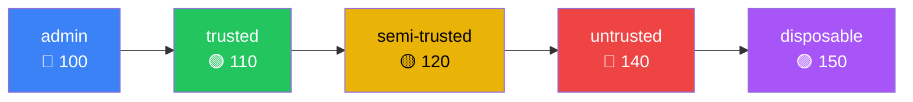
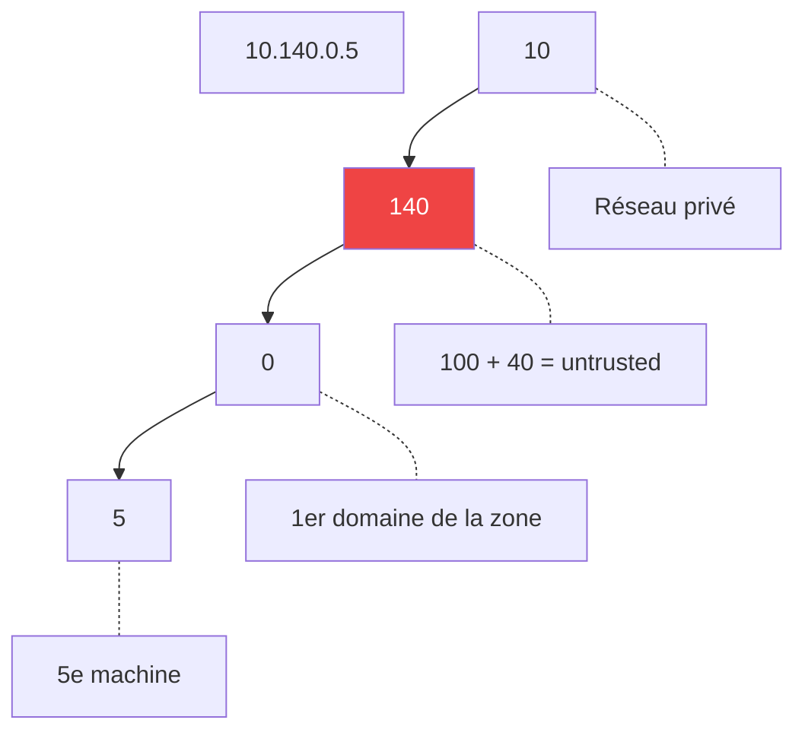

# Niveaux de confiance

Chaque domaine a un **niveau de confiance** (trust level) qui encode
sa posture de sécurité. Ce niveau est visible dans l'adressage IP.

## Les 5 niveaux



| Niveau | Offset zone | 2e octet | Couleur | Usage |
|---|---|---|---|---|
| `admin` | 0 | 100 | bleu | Gestion infrastructure |
| `trusted` | 10 | 110 | vert | Services de confiance |
| `semi-trusted` | 20 | 120 | jaune | Usage quotidien (défaut) |
| `untrusted` | 40 | 140 | rouge | Logiciels tiers, tests |
| `disposable` | 50 | 150 | magenta | Éphémère, jetable |

## Adressage IP

Les IPs encodent le niveau de confiance dans le deuxième octet :

```
10.<zone_base + zone_offset>.<domain_seq>.<host>/24
```



Depuis `10.140.0.5`, un admin sait immédiatement : zone 140 = 100 + 40
= **untrusted**.

### Convention d'adressage

- `.1` à `.99` — IPs statiques (machines)
- `.100` à `.199` — DHCP
- `.254` — passerelle (bridge)

### Séquencement des domaines

`domain_seq` est auto-assigné alphabétiquement dans chaque zone de
confiance. Le premier domaine `semi-trusted` obtient le sous-réseau
`10.120.0.0/24`, le deuxième `10.120.1.0/24`, etc.

## Impact sur l'isolation

Le niveau de confiance influence :

1. **L'adressage IP** — zones séparées dans l'espace d'adressage
2. **nftables** — tout trafic inter-domaines bloqué par défaut
3. **Couleur KDE** — barre de titre colorée par niveau (identité visuelle)
4. **Protection ephemeral** — `disposable` est éphémère par défaut
