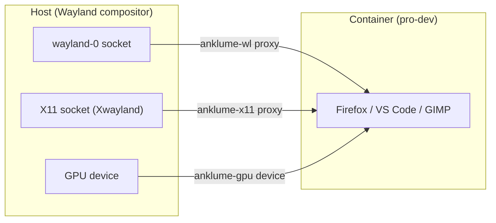

# Desktop Integration

anklume provides desktop environment integration for workstation users.
Domain-colored visual cues in terminals and window managers give instant
feedback about which security domain you're working in — the same model
as QubesOS colored window borders.

## Quick start

```bash
anklume console                    # tmux console with colored panes
anklume domain exec pro-dev --terminal  # Colored terminal window
anklume instance clipboard to pro-dev     # Copy host clipboard to container
anklume instance clipboard from pro-dev   # Copy container clipboard to host
anklume desktop config             # Generate Sway/foot/.desktop configs
anklume dashboard                  # Web dashboard on http://localhost:8888
```

## tmux Console (Phase 19a)

The tmux console auto-generates a session from `infra.yml` with
per-domain colored panes:

```bash
anklume console          # Create and attach
anklume console --kill   # Recreate session
anklume console --dry-run  # Preview without creating
```

Colors are set **server-side** via `select-pane -P 'bg=...'` — containers
cannot spoof their visual identity (same security model as QubesOS dom0
colored borders).

| Trust Level | Color | tmux Code |
|------------|-------|-----------|
| admin | Dark blue | colour17 |
| trusted | Dark green | colour22 |
| semi-trusted | Dark yellow | colour58 |
| untrusted | Dark red | colour52 |
| disposable | Dark magenta | colour53 |

Reconnect: `tmux attach -t anklume`

## Clipboard Forwarding

Controlled clipboard sharing between host and containers. Each transfer
is an **explicit user action** — no automatic clipboard sync between
domains.

```bash
# Host clipboard → container
anklume instance clipboard to pro-dev
scripts/clipboard.sh copy-to pro-dev --project pro

# Container clipboard → host
anklume instance clipboard from pro-dev
scripts/clipboard.sh copy-from pro-dev --project pro
```

### How it works

- Uses `wl-copy`/`wl-paste` (Wayland) or `xclip`/`xsel` (X11) on the host
- Transfers via `incus file push`/`pull` to `/tmp/anklume-clipboard`
- Compatible with the MCP `clipboard_get`/`clipboard_set` tools (Phase 20c)
- Auto-detects display server and clipboard backend

### Security model

- Every clipboard transfer is a conscious user decision
- No daemon, no background sync, no automatic bridging
- Each direction is a separate command — read and write are explicit
- Container cannot trigger clipboard reads from the host

## Domain-Exec Wrapper

Launch commands in containers with domain context:

```bash
# Interactive shell in container
anklume domain exec pro-dev

# Colored terminal window
anklume domain exec pro-dev --terminal

# Run a specific command
scripts/domain-exec.sh pro-dev -- htop

# Colored terminal with specific command
scripts/domain-exec.sh pro-dev --terminal -- firefox
```

### Environment variables

The wrapper sets these inside the container:

| Variable | Description |
|----------|-------------|
| `ANKLUME_DOMAIN` | Domain name (e.g., `pro`) |
| `ANKLUME_TRUST_LEVEL` | Trust level (e.g., `trusted`) |
| `ANKLUME_INSTANCE` | Instance name (e.g., `pro-dev`) |

### Terminal mode

With `--terminal`, the wrapper opens a new terminal window with:
- Window title: `[domain] instance` (e.g., `[pro] pro-dev`)
- Background color matching the domain trust level
- Supported terminals: foot (Wayland), alacritty, xterm

## Desktop Environment Integration

Generate configuration snippets for desktop environments:

```bash
anklume desktop config             # Generate all configs
python3 scripts/desktop_config.py --sway    # Sway/i3 only
python3 scripts/desktop_config.py --foot    # foot terminal only
python3 scripts/desktop_config.py --desktop # .desktop entries only
```

Output goes to `desktop/` directory.

### Sway/i3

Generated config colorizes window borders by domain:

```
# In ~/.config/sway/config (or config.d/anklume.conf)
default_border pixel 3
for_window [title="^\[admin\]"] border pixel 3
for_window [title="^\[admin\]"] client.focused #3333ff #3333ff #ffffff #3333ff
for_window [title="^\[pro\]"] border pixel 3
for_window [title="^\[pro\]"] client.focused #33cc33 #33cc33 #ffffff #33cc33
```

Windows are matched by title pattern (set by `domain-exec.sh`) or
`app_id` pattern (set by `--terminal` mode).

### foot terminal

Generated profiles provide domain-colored backgrounds:

```ini
# foot --override 'colors.background=#0a0a2a'   # admin (dark blue)
# foot --override 'colors.background=#0a1a0a'   # pro (dark green)
```

### .desktop entries

Generated `.desktop` files for quick-launch from application menus:

```
~/.local/share/applications/
├── anklume-anklume-instance.desktop
├── anklume-pro-dev.desktop
└── anklume-perso-desktop.desktop
```

Each entry launches `domain-exec.sh` with `--terminal` for the
corresponding instance.

## Web Dashboard

Live infrastructure status in a browser:

```bash
anklume dashboard              # http://localhost:8888
anklume dashboard --port 9090    # Custom port
anklume dashboard --host 0.0.0.0 # Listen on all interfaces
```

### Features

- Real-time instance status (auto-refresh every 5s via htmx)
- Domain-colored instance cards with trust level badges
- Network listing with subnet information
- Network policy visualization
- No external Python dependencies (uses stdlib `http.server` + htmx CDN)

### API endpoints

| Endpoint | Description |
|----------|-------------|
| `GET /` | Main dashboard page |
| `GET /api/status` | JSON: instances, networks, policies |
| `GET /api/infra` | JSON: parsed infra.yml |
| `GET /api/html` | HTML fragment for htmx updates |

### Security

- **Read-only** — the dashboard does not modify infrastructure
- **Local only** by default (binds to `127.0.0.1`)
- Use `HOST=0.0.0.0` to expose on the network (use with caution)
- No authentication — rely on network-level access control

## Color scheme

All desktop integration tools share the same trust level → color mapping:

| Trust Level | Border (bright) | Background (dark) | Description |
|-------------|----------------|-------------------|-------------|
| admin | `#3333ff` | `#0a0a2a` | Full system access |
| trusted | `#33cc33` | `#0a1a0a` | Production, personal |
| semi-trusted | `#cccc33` | `#1a1a0a` | Development, testing |
| untrusted | `#cc3333` | `#1a0a0a` | Risky software |
| disposable | `#cc33cc` | `#1a0a1a` | Ephemeral sandboxes |

Colors are configurable via `trust_level` in `infra.yml` (see SPEC.md).

## GUI App Forwarding

Launch graphical applications from containers on the host display.
Uses the same proxy device pattern as audio forwarding — Wayland/X11
sockets and GPU access are forwarded into the container via Incus
proxy devices.

### How it works



| Resource | Host path | Container path | Device name |
|----------|-----------|----------------|-------------|
| Wayland socket | `/run/user/$UID/wayland-0` | `/tmp/wayland-0` | `anklume-wl` |
| X11 socket | `/tmp/.X11-unix/X0` | `/tmp/.X11-unix/X0` | `anklume-x11` |
| GPU | N/A (Incus gpu type) | N/A | `anklume-gpu` |

### Usage

```bash
# Launch a GUI app in a container
scripts/domain-exec.sh pro-dev --gui -- firefox

# Interactive shell with display forwarding
scripts/domain-exec.sh pro-dev --gui

# Via Makefile
make domain-exec I=pro-dev GUI=1
make domain-exec I=pro-dev GUI=1 -- firefox
```

Exported apps automatically include `--gui`:

```bash
make export-app I=pro-dev APP=firefox   # .desktop Exec uses --gui
```

### Environment variables

When `--gui` is active, these are set inside the container:

| Variable | Value |
|----------|-------|
| `WAYLAND_DISPLAY` | `wayland-0` |
| `XDG_RUNTIME_DIR` | `/tmp` |
| `DISPLAY` | `:0` |
| `GDK_BACKEND` | `wayland,x11` |
| `QT_QPA_PLATFORM` | `wayland;xcb` |

### Security model

GUI forwarding grants the container access to the host display
server and GPU. This is the same trade-off as QubesOS GUI
virtualization — apps render on the trusted display, but a
compromised app could potentially read other windows or keylog.

- **admin / trusted / semi-trusted**: forwarding proceeds silently
  (same trust model as QubesOS for these levels)
- **untrusted / disposable**: a warning is printed to stderr before
  proceeding. The user must acknowledge the risk.

`--gui` is opt-in (not automatic) because display forwarding
adds meaningful attack surface compared to audio-only forwarding.

### Known limitations

- **Window borders**: Sway domain-colored borders work for
  `--terminal` windows (title matching). GUI app windows use their
  own `app_id`, so domain coloring depends on the app's title
  containing the domain name.
- **GPU sharing**: Only one container should use the GPU at a time
  for VRAM isolation (see ADR-018). Multiple `--gui` sessions
  sharing the GPU is possible but not recommended for untrusted
  domains.
