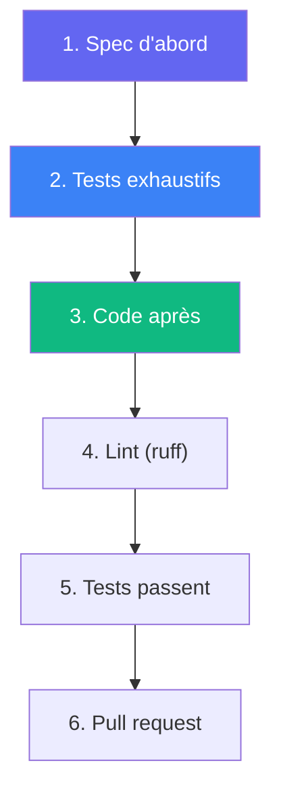

# Contribuer

## Installation développeur

```bash
git clone https://github.com/jmchantrein/AnKLuMe.git
cd AnKLuMe
uv sync --group dev
```

## Conventions de code

### Python

- **Typer** pour la CLI, **FastAPI** pour le web, **PyYAML** pour le parsing
- **Type hints** sur les fonctions publiques
- **ruff** pour lint + format (zéro violation)
- Un fichier = une responsabilité

### Shell

- `shellcheck` propre
- `set -euo pipefail`
- Uniquement pour les scripts de boot et l'intégration système

### Langue

- **Français** : docs, commentaires, UI, messages CLI
- **Anglais** : code (variables, fonctions, classes, CLI)

## Workflow



**Spec-driven, test-driven** : spécification d'abord, tests exhaustifs
ensuite (unitaires, Molecule, E2E et Behavior), code après.

## Vérifications

```bash
# Lint
anklume dev lint

# Tests
anklume dev test

# Tests Molecule
anklume dev molecule
```

## Structure du code source

```
src/anklume/
  cli/              # Commandes CLI (Typer)
  engine/           # Moteur PSOT (domains/*.yml → Incus)
  provisioner/      # Interface Ansible
  i18n/             # Traductions (fr, en)
tests/              # pytest + behave
```

## CI/CD

GitHub Actions exécute automatiquement sur chaque push et PR :

1. **lint** — `ruff check` + `ruff format --check`
2. **shellcheck** — scripts shell
3. **test** — `pytest` (unitaires)
4. **build** — `uv build`
