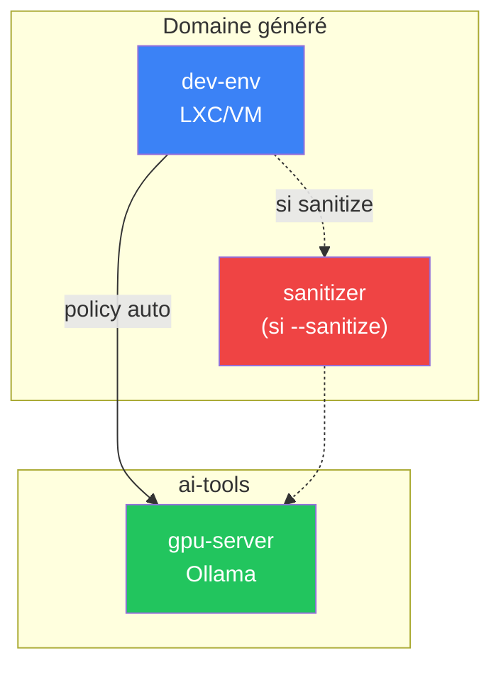

# Environnement de développement

Génération automatique de domaines de développement isolés.

## Commande

```bash
anklume dev env mon-env \
  --type lxc \
  --gpu \
  --llm \
  --claude-code \
  --mount projects=/home/user/projects
```

## Options

| Option | Description |
|---|---|
| `--type lxc\|vm` | Type d'instance |
| `--gpu` | Activer le GPU passthrough |
| `--llm` | Activer l'accès LLM (Ollama) |
| `--claude-code` | Installer Claude Code CLI |
| `--mount nom=chemin` | Volume persistant (répétable) |
| `--memory` | Limite mémoire |
| `--cpu` | Limite CPU |
| `--preset anklume` | Preset self-dev avec toute la chaîne |

## Backends LLM

| Option | Description |
|---|---|
| `--llm-backend local` | Ollama local (défaut si GPU) |
| `--llm-backend openai` | API OpenAI-compatible |
| `--llm-backend anthropic` | API Anthropic |
| `--llm-model <model>` | Modèle par défaut |
| `--sanitize false\|true\|always` | Proxy de sanitisation |

## Architecture générée



## Preset `anklume`

```bash
anklume dev env self-dev --preset anklume
```

Génère un environnement complet pour développer anklume lui-même :
GPU, LLM, Claude Code, mount du repo source, outils de dev (uv,
ripgrep, lazygit, etc.).

## Rôle `dev_env`

Outillage installé automatiquement :

- **Python** : uv, Python 3.11+
- **Node.js** : via apt/snap
- **Outils** : ripgrep, fd, fzf, lazygit, direnv
- **IA** : Claude Code CLI, aider (optionnels)
- **Config** : git, utilisateur non-root, paquets extras
