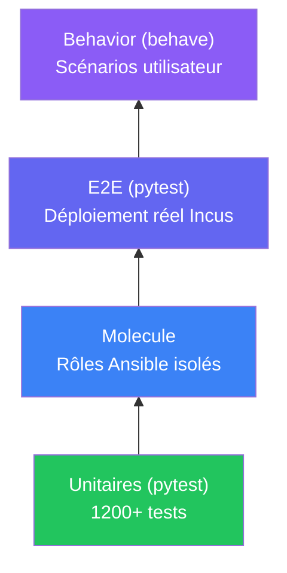
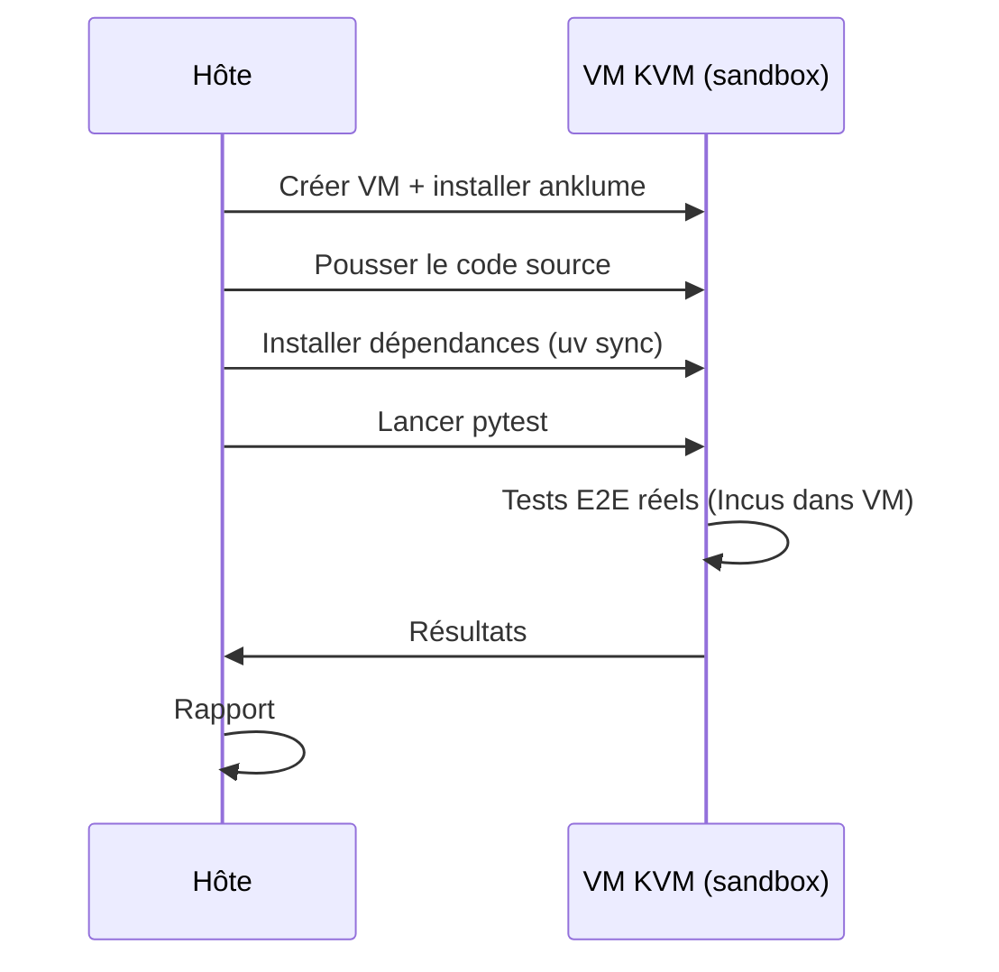

# Tests

## Pyramide de tests



| Niveau | Outil | Cible | Nombre |
|---|---|---|---|
| **Unitaires** | pytest | Logique Python, engine, CLI | 1200+ |
| **Molecule** | molecule | Rôles Ansible dans conteneurs Incus | variable |
| **E2E** | pytest | Déploiement réel (apply, destroy, idempotence) | 22 |
| **Behavior** | behave | Scénarios utilisateur de bout en bout | 8 |

## Commandes

```bash
# Tests unitaires
anklume dev test

# Tests Molecule (rôles Ansible)
anklume dev molecule

# Lint (ruff check + format)
anklume dev lint
```

## Tests réels en VM KVM

anklume peut se tester lui-même dans une VM KVM isolée :

```bash
# Lancer les tests réels
anklume dev test-real

# Avec options
anklume dev test-real --keep --verbose --filter "test_driver"
```



### Options

| Option | Description |
|---|---|
| `--keep` | Conserver la VM après les tests |
| `--filter/-k` | Filtre pytest |
| `--verbose/-v` | Sortie complète |
| `--memory` | Mémoire de la VM |
| `--cpu` | CPUs de la VM |
| `--timeout` | Timeout global |

### Scénarios testés

- Driver CRUD (projet, réseau, instance, exec)
- Snapshots (create, list, restore, rollback)
- Réconciliateur (apply, idempotence, restart)
- Destroy (protection ephemeral, --force)
- Status, nftables, nesting, portal, disposable
- Golden images, import, doctor, network status
- Provisioner Ansible, console tmux
