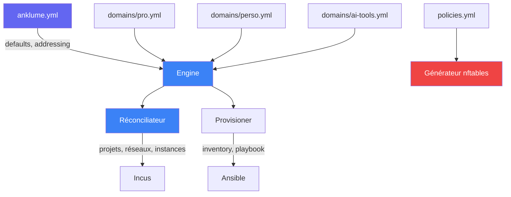

# Structure d'un projet

Un projet anklume est un répertoire contenant des fichiers YAML
déclaratifs. Tout est commitable dans git.

## Arborescence

```
mon-infra/
  anklume.yml                 # Config globale
  domains/                    # Un fichier par domaine
    pro.yml
    perso.yml
    ai-tools.yml
  policies.yml                # Politiques réseau (optionnel)
  ansible/                    # Provisioning (généré + personnalisable)
    inventory/                # Inventaire (généré depuis domains/)
    group_vars/               # Variables par domaine
    host_vars/                # Variables par machine
    site.yml                  # Playbook principal
  ansible_roles_custom/       # Rôles utilisateur (optionnel)
```

## `anklume.yml` — config globale

```yaml
schema_version: 1

defaults:
  os_image: images:debian/13    # Image par défaut
  trust_level: semi-trusted     # Niveau de confiance par défaut

addressing:
  base: "10.100"                # Base d'adressage
  zone_step: 10                 # Pas entre zones

nesting:
  prefix: true                  # Préfixer les ressources par niveau

resource_policy:                # Allocation CPU/mémoire (optionnel)
  host_reserve:
    cpu: "20%"
    memory: "20%"
  mode: proportional
```

## `domains/*.yml` — domaines

Chaque fichier décrit un domaine isolé (un sous-réseau + un projet Incus).

```yaml
# domains/pro.yml
description: "Environnement professionnel"
trust_level: semi-trusted

machines:
  dev:
    description: "Développement"
    type: lxc
    roles: [base, dev-tools]
    persistent:
      projects: /home/user/projects

  desktop:
    description: "Bureau KDE"
    type: lxc
    gpu: true
    roles: [base, desktop]

profiles:
  gpu-passthrough:
    devices:
      gpu:
        type: gpu
```

## `policies.yml` — politiques réseau

```yaml
policies:
  - from: pro
    to: ai-tools
    ports: [11434, 3000]
    description: "Pro accède à Ollama et Open WebUI"

  - from: host
    to: shared-dns
    ports: [53]
    protocol: udp
    description: "DNS local"
```

## Relation entre les fichiers


