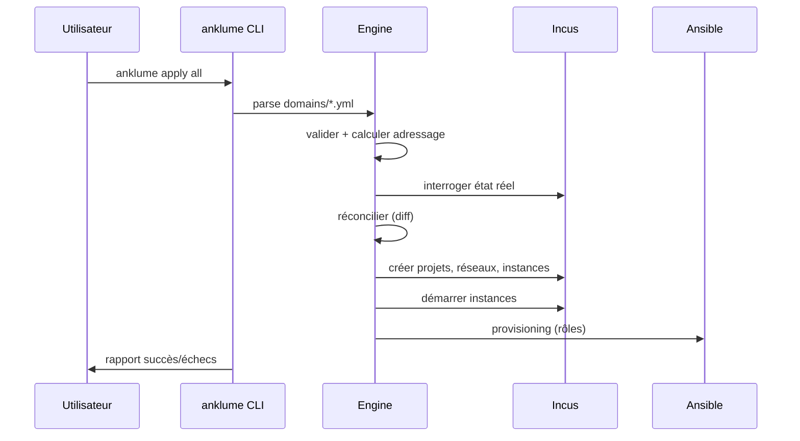

# Démarrage rapide

!!! note "Prérequis"
    AnKLuMe et Incus doivent être installés.
    Voir [Installation](installation.md) si ce n'est pas fait.

## Créer un projet

```bash
anklume init mon-infra
cd mon-infra
```

Ceci génère la structure complète avec des exemples commentés.

## Comprendre le projet généré

```
mon-infra/
  anklume.yml           # Config globale
  domains/
    pro.yml             # Domaine professionnel
    perso.yml           # Domaine personnel
  policies.yml          # Politiques réseau
```

## Éditer un domaine

```yaml
# domains/pro.yml
description: "Environnement professionnel"
trust_level: semi-trusted

machines:
  dev:
    description: "Machine de développement"
    type: lxc
    roles: [base, dev-tools]
```

## Déployer



```bash
# Voir ce qui va se passer (sans appliquer)
anklume apply all --dry-run

# Déployer
anklume apply all

# Vérifier l'état
anklume status
```

## Opérations courantes

```bash
# Lister les instances
anklume instance list

# Exécuter une commande dans une instance
anklume instance exec pro-dev -- bash

# Snapshotter
anklume snapshot create

# Détruire (respecte la protection ephemeral)
anklume destroy
```

## Étapes suivantes

- [Concepts : domaines et machines](../concepts/domaines.md)
- [Concepts : niveaux de confiance](../concepts/trust-levels.md)
- [Référence CLI complète](../cli/index.md)
