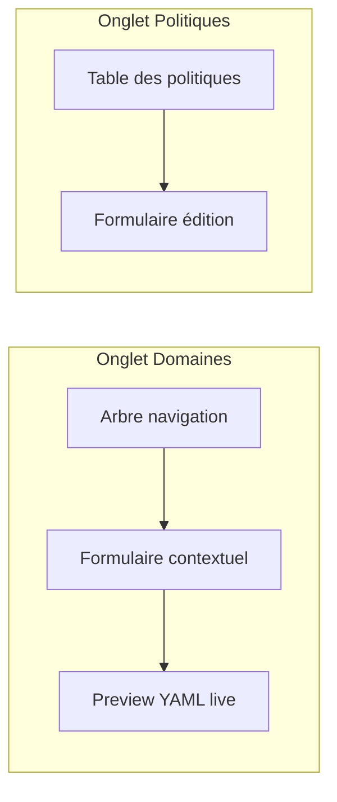
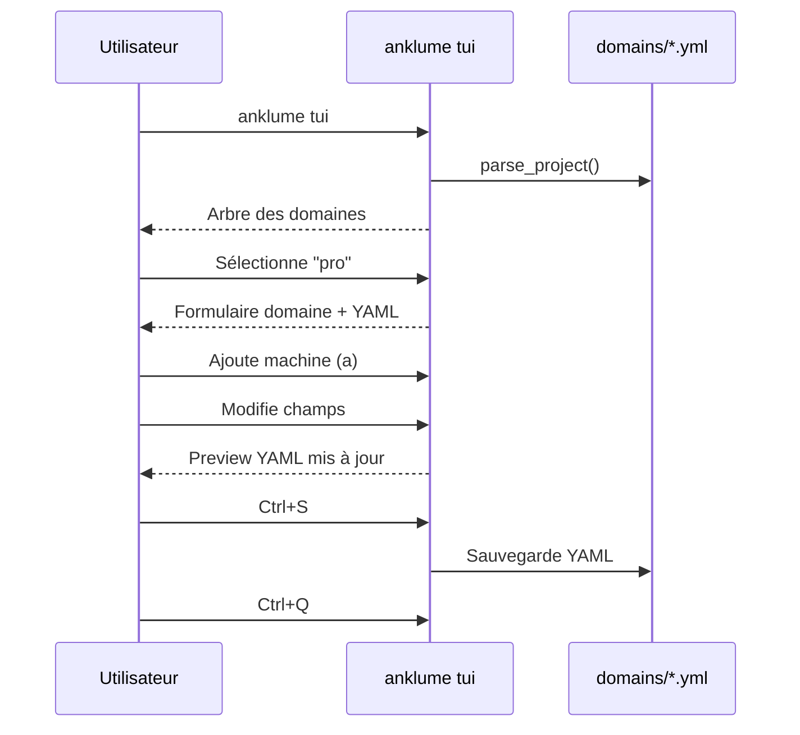

# Éditeur TUI interactif

L'éditeur TUI (`anklume tui`) est une interface en mode terminal pour
créer et modifier visuellement les domaines, machines et politiques réseau.

## Lancement

```bash
anklume tui                    # projet courant
anklume tui --project /chemin  # projet spécifique
```

!!! note "Dépendance optionnelle"
    Le TUI nécessite [Textual](https://textual.textualize.io/).
    Installation : `uv pip install 'anklume[tui]'`

## Interface

L'éditeur utilise un layout master-detail avec deux onglets :



### Arbre de navigation

L'arbre affiche les domaines et leurs machines avec des couleurs
correspondant au trust-level :

- :red_circle: **admin** — rouge
- :blue_circle: **trusted** — bleu
- :yellow_circle: **semi-trusted** — jaune
- :purple_circle: **untrusted** — violet
- :white_circle: **disposable** — gris

Les domaines sont préfixés d'une icône de dossier, les machines
d'un engrenage (VM) ou d'un carré (LXC).

### Formulaire domaine

Champs éditables quand un domaine est sélectionné :

| Champ | Type | Description |
|---|---|---|
| Description | texte | Description du domaine |
| Trust level | sélection | Niveau de confiance (admin, trusted, semi-trusted, untrusted, disposable) |
| Activé | switch | Domaine activé/désactivé |
| Éphémère | switch | Domaine éphémère (détruit au shutdown) |

### Formulaire machine

Champs éditables quand une machine est sélectionnée :

| Champ | Type | Description |
|---|---|---|
| Description | texte | Description de la machine |
| Type | sélection | LXC (conteneur) ou VM (KVM) |
| IP | texte | Adresse IP (vide = auto) |
| GPU | switch | Passthrough GPU |
| GUI | switch | Interface graphique |
| Weight | nombre | Poids pour l'allocation de ressources |
| Rôles | sélection multiple | Rôles Ansible embarqués |

Les rôles Ansible disponibles sont détectés automatiquement depuis
`provisioner/roles/`.

### Preview YAML

Le panneau de droite affiche en temps réel le YAML correspondant
à l'élément sélectionné. Seuls les champs non-défaut sont affichés,
conformément au modèle PSOT.

### Table des politiques

L'onglet Politiques affiche toutes les règles réseau et permet de
les éditer inline :

- **De** / **Vers** — cible (domaine, machine ou hôte)
- **Ports** — liste numérique ou `all`
- **Protocole** — TCP ou UDP
- **Bidirectionnel** — switch oui/non

## Raccourcis clavier

| Raccourci | Action |
|---|---|
| `Ctrl+S` | Sauvegarder tous les fichiers |
| `Ctrl+Q` | Quitter |
| `a` | Ajouter un domaine ou une machine |
| `d` | Supprimer l'élément sélectionné |

## Sauvegarde

`Ctrl+S` écrit :

- Un fichier par domaine dans `domains/<nom>.yml`
- Les politiques dans `policies.yml`

Les fichiers sont au format YAML compact (valeurs par défaut omises).

## Workflow typique


