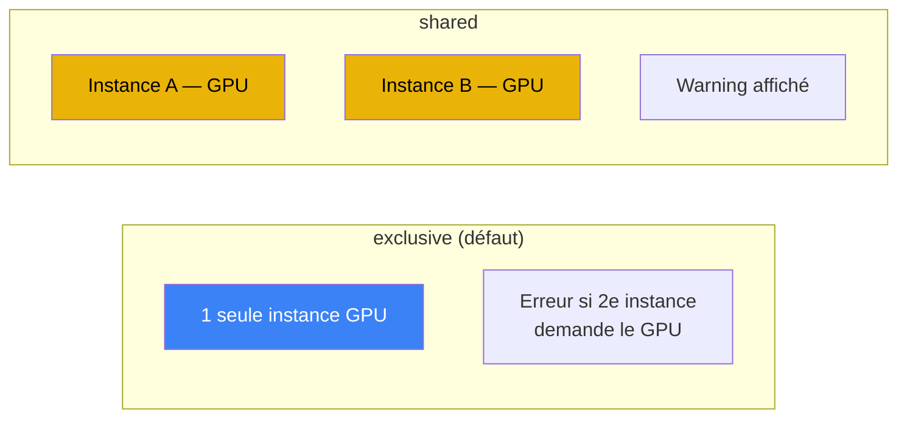

# GPU passthrough

## Détection

anklume détecte le GPU via `nvidia-smi` :

- Présence du GPU
- Modèle (ex: RTX PRO 5000)
- VRAM totale et utilisée

## Profils GPU

Quand un GPU est détecté, anklume crée automatiquement un profil
Incus `gpu-passthrough` :

```yaml
devices:
  gpu:
    type: gpu
    gid: "0"
    uid: "0"
```

Les machines avec `gpu: true` reçoivent ce profil automatiquement.

## Politique GPU

Configurée dans `anklume.yml` :

```yaml
gpu_policy: exclusive    # exclusive (défaut) ou shared
```



| Mode | Comportement |
|---|---|
| `exclusive` | Une seule instance GPU à la fois, erreur sinon |
| `shared` | Plusieurs instances partagent le GPU, warning |

## Validation

- `gpu: true` sans GPU détecté → **erreur**
- `gpu: true` avec politique `exclusive` + autre instance GPU → **erreur**

## Gestion VRAM

```bash
# Voir l'état VRAM
anklume ai status

# Décharger tous les modèles Ollama + arrêter llama-server
anklume ai flush
```

`flush` libère la VRAM en :

1. Déchargeant les modèles Ollama (`/api/generate` avec `keep_alive: 0`)
2. Arrêtant llama-server si actif
3. Mesurant la VRAM avant/après

## Accès exclusif

```bash
# Basculer l'accès GPU vers un domaine
anklume ai switch ai-tools
```

L'état est stocké dans `/var/lib/anklume/ai-access.json`.
