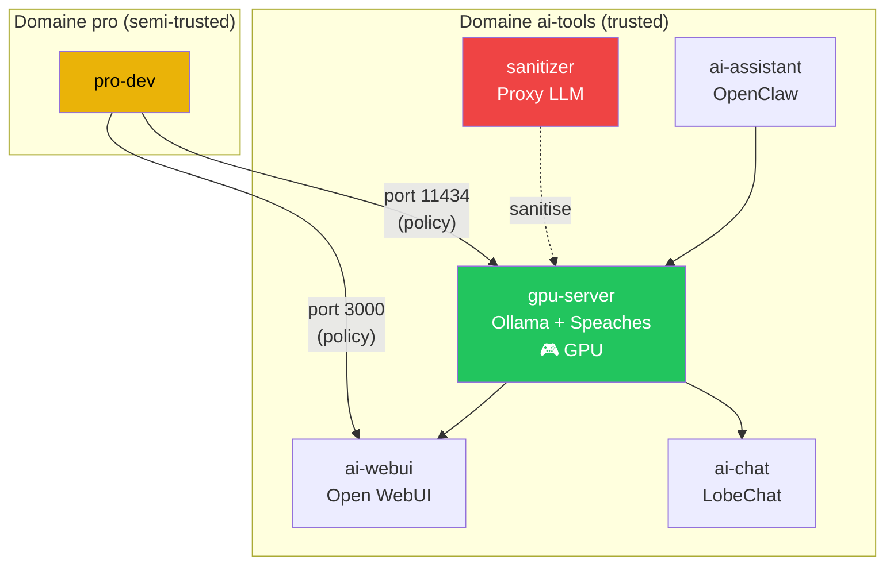

# Intelligence artificielle

anklume intègre une stack IA complète : GPU passthrough, LLM local
(Ollama), STT (Speaches), interfaces de chat, sanitisation et routage.

## Architecture IA



## Services IA disponibles

| Service | Rôle Ansible | Port | Description |
|---|---|---|---|
| Ollama | `ollama_server` | 11434 | Serveur LLM local |
| Speaches | `stt_server` | 8000 | STT (Whisper) |
| Open WebUI | `open_webui` | 3000 | Interface web Ollama |
| LobeChat | `lobechat` | 3210 | Chat multi-providers |
| Sanitizer | `llm_sanitizer` | 8089 | Proxy d'anonymisation |
| OpenClaw | `openclaw_server` | — | Assistant autonome |
| Code Sandbox | `code_sandbox` | — | Sandbox de coding IA |

## Gestion GPU

```bash
# État des services IA
anklume ai status

# Libérer la VRAM
anklume ai flush

# Basculer l'accès GPU
anklume ai switch ai-tools
```

## Pages détaillées

- [GPU passthrough](gpu.md) — détection, profils, politique d'accès
- [Routage LLM](routage-llm.md) — choix local/externe + sanitisation
- [Push-to-talk STT](stt.md) — dictée vocale sur KDE Wayland
