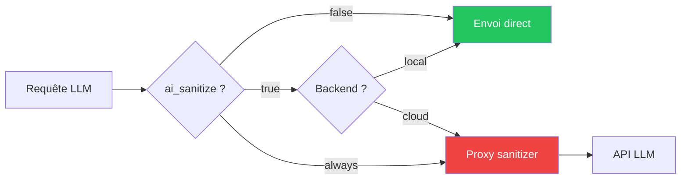

# Routage LLM

Choix du backend LLM (local Ollama, API cloud, abonnement) avec
routage conditionnel via le proxy de sanitisation.

## Backends supportés

| Backend | Valeur | Description |
|---|---|---|
| Ollama local | `local` | LLM sur le GPU local |
| OpenAI-compatible | `openai` | OpenRouter, Groq, Together, etc. |
| Claude API | `anthropic` | API Anthropic |

## Configuration par machine

```yaml
# dans domains/*.yml
machines:
  dev:
    vars:
      llm_backend: openai
      llm_url: "https://openrouter.ai/api/v1"
      llm_api_key: "{{ vault_openrouter_key }}"
      llm_model: "anthropic/claude-sonnet-4-20250514"
```

## Sanitisation conditionnelle



| Valeur `ai_sanitize` | Comportement |
|---|---|
| `false` | Envoi direct (défaut) |
| `true` | Sanitise les requêtes vers les backends cloud uniquement |
| `always` | Sanitise même le local |

## Proxy de sanitisation

Le proxy anonymise les données sensibles avant envoi :

- **IPs privées** RFC 1918 → `[IP_REDACTED_1]`
- **Ressources Incus** (instances, bridges)
- **FQDNs internes** (*.internal, *.local, *.corp)
- **Credentials** (bearer tokens, clés API)
- **MAC addresses**, **sockets Unix**, **commandes Incus**

Modes :

- `mask` — placeholders indexés
- `pseudonymize` — remplacement cohérent dans une session

`desanitize()` restaure les valeurs originales dans la réponse.

## Commandes

```bash
# Vue backends LLM par instance
anklume llm status

# Benchmark inférence
anklume llm bench

# Dry-run sanitisation
anklume llm sanitize "Mon IP est 192.168.1.1" --mode mask
```
