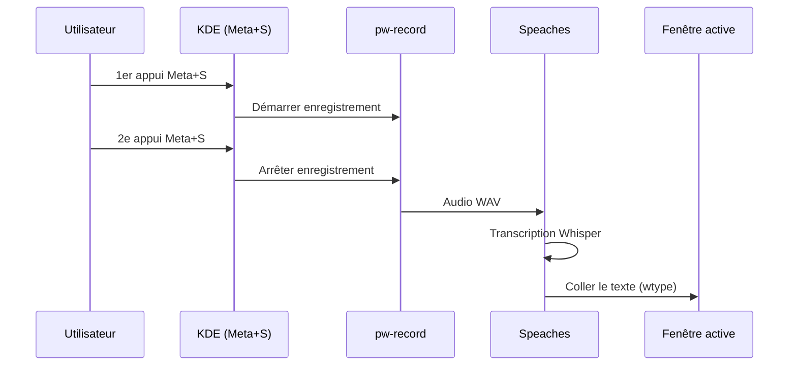

# Push-to-talk STT

Dictée vocale sur l'hôte KDE Plasma Wayland via Speaches (Whisper).

## Principe



## Fonctionnalités

- **Toggle** : 1er appui → enregistre, 2e appui → transcrit et colle
- **Détection fenêtre** : `Ctrl+Shift+V` pour les terminaux, `Ctrl+V` pour le reste
- **AZERTY** : support complet des accents et dead keys via `wtype`
- **Streaming** : mode temps réel avec chunks audio de ~3 secondes
- **Filtrage** : suppression des hallucinations Whisper

## Installation

```bash
# Vérifier les dépendances et configurer le raccourci
anklume stt setup
```

Dépendances vérifiées : `pw-record`, `wtype`, `wl-copy`, `kdotool`,
`jq`, `notify-send`.

## Configuration

| Variable | Défaut | Description |
|---|---|---|
| `STT_API_URL` | `http://10.100.3.1:8000` | URL du serveur Speaches |
| `STT_MODEL` | auto | Modèle Whisper |
| `STT_LANGUAGE` | `fr` | Langue de transcription |

## Commandes

```bash
anklume stt setup    # Configurer
anklume stt start    # Démarrer
anklume stt stop     # Arrêter
anklume stt status   # État du service
```

## Architecture serveur

Le serveur Speaches tourne dans le conteneur `gpu-server` du domaine
`ai-tools`, coexiste avec Ollama sur le même GPU.

- API OpenAI-compatible (`/v1/audio/transcriptions`)
- GPU float16 si disponible, fallback int8 CPU
- Port configurable (défaut 8000)
