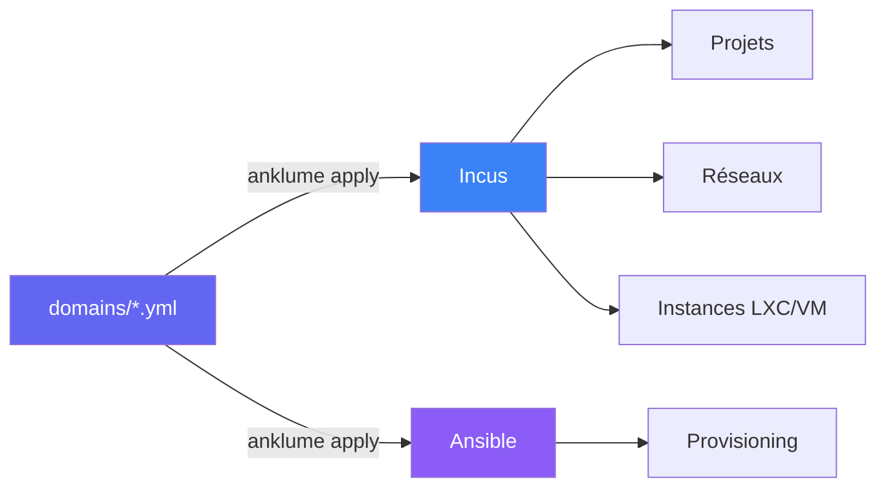

# anklume

**Cloisonnez votre poste de travail Linux. Utilisez l'IA en sécurité.**

Décrivez vos environnements en YAML, lancez `anklume apply all`,
obtenez des conteneurs et VMs isolés avec réseau cloisonné (nftables),
provisionnés par Ansible et prêts à l'emploi.



## Pourquoi anklume ?

### Tester et utiliser l'IA sans compromettre ses données

Les agents IA et LLM ont besoin d'un accès système (shell, fichiers,
réseau) pour être utiles. Sur un poste bare-metal, c'est un risque
majeur : fuites de données personnelles, credentials exposées,
exécution de code non audité.

- **IA locale isolée** — LLM (Ollama) avec GPU passthrough dans un
  domaine dédié, cloisonné par nftables
- **IA cloud sanitisée** — proxy de sanitisation qui tokenise les
  données sensibles avant envoi aux LLM cloud
- **Tester en sécurité** — chaque agent/outil IA tourne dans un
  conteneur/VM jetable

### Enseigner l'administration système et le réseau

L'enseignant prépare une infrastructure et la distribue via git.
Les étudiants déploient avec `anklume apply all` et manipulent une
vraie infra. Idempotent, reproductible, jetable.

### Compartimentaliser son poste de travail

Séparer pro/perso/dev/sandbox/IA sur une seule machine. Un domaine =
un sous-réseau + un projet Incus. Drop-all par défaut entre domaines.

## Principe

```yaml
# domains/pro.yml
description: "Environnement professionnel"
trust_level: semi-trusted

machines:
  dev:
    description: "Développement"
    type: lxc
    roles: [base, dev-tools]

  desktop:
    description: "Bureau KDE"
    type: lxc
    gpu: true
    roles: [base, desktop]
```

## Isolation : LXC vs VM

| | LXC | VM (KVM) |
|---|---|---|
| Noyau | Partagé (hôte) | Séparé (hyperviseur type 1) |
| Performance | Native | Overhead virtualisation |
| Usage recommandé | Charges de confiance | Charges non fiables, jetables |

anklume n'est pas un OS sécurisé. Les conteneurs LXC partagent le
noyau hôte. Pour les domaines untrusted et disposable, utiliser
`type: vm` (KVM, noyau séparé).

## Démarrage rapide

```bash
# Installer AnKLuMe et ses dépendances
git clone https://github.com/jmchantrein/AnKLuMe.git
cd AnKLuMe/host
less quickstart.sh        # lire avant d'exécuter
sudo ./quickstart.sh

# Créer un projet
anklume init mon-infra
cd mon-infra

# Déployer
anklume apply all

# Vérifier
anklume status
```

> [Guide d'installation détaillé](guide/installation.md)

## Fonctionnalités

### Cœur

Le pipeline YAML → Incus + nftables + Ansible. Stable, testé,
utilisé quotidiennement.

| Fonctionnalité | Description |
|---|---|
| **Isolation par domaines** | Un projet Incus + sous-réseau + nftables par domaine |
| **PSOT stateless** | Réconciliation sans state file — YAML + Incus = source de vérité |
| **Provisioning Ansible** | Rôles embarqués + rôles custom utilisateur |
| **Réseau nftables** | Drop-all par défaut, politiques déclaratives |
| **GPU passthrough** | Accès exclusif ou partagé au GPU |
| **Snapshots automatiques** | Pré/post-apply, rollback destructif |
| **Nesting Incus** | 2 niveaux en usage réel, 5 niveaux validés en benchmark |
| **Portails fichiers** | Transfert hôte ↔ conteneur sans compromettre l'isolation |
| **Golden images** | Publier des instances comme images réutilisables |

### Extensions intégrées

Fonctionnalités optionnelles construites sur le cœur. Elles ne sont
pas requises pour l'isolation de base et peuvent évoluer indépendamment.
Pour ajouter vos propres commandes, voir le système de plugins.

| Fonctionnalité | Description |
|---|---|
| **TUI interactif** | Éditeur visuel de domaines et politiques (`anklume tui`) |
| **Routage LLM** | Backend local/cloud, proxy de sanitisation automatique |
| **Push-to-talk STT** | Dictée vocale via Speaches (KDE Wayland) |
| **Passerelle Tor** | VM routeur transparent Tor |
| **Workspace layout** | Placement déclaratif des fenêtres GUI (KDE) |

> **Stabilité** : les fonctionnalités cœur sont utilisées quotidiennement
> et couvertes par les tests. Les extensions sont fonctionnelles mais
> peuvent évoluer plus rapidement.

## Ce que anklume n'est PAS

- **Pas un OS sécurisé.** QubesOS (Xen) offre une isolation hardware
  supérieure, mais ne supporte pas l'inférence LLM locale avec GPU
  passthrough (Ollama freeze à l'initialisation du modèle). anklume
  utilise KVM (hyperviseur type 1, noyau séparé) pour les VM et des
  conteneurs LXC (noyau partagé) pour les charges légères.
- Pas une web app ni une API
- Pas un remplacement d'Ansible, d'Incus ou de nftables
- Pas un orchestrateur multi-machines
- Pas lié à une distribution Linux spécifique

## Architecture


