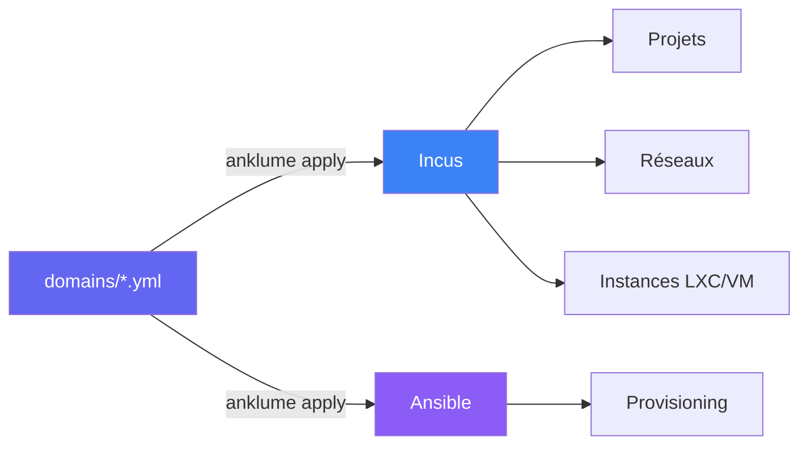
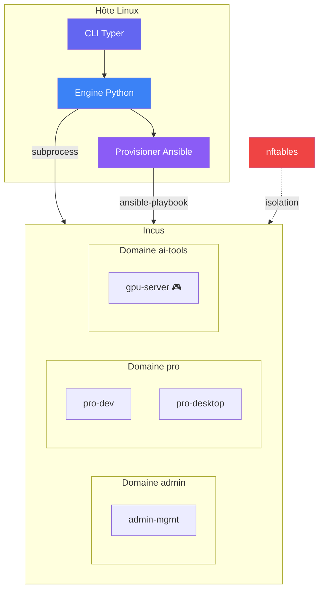

# anklume

**Framework déclaratif de compartimentalisation d'infrastructure.**

Isolation avec Incus (LXC/KVM) + nftables, sur n'importe quel Linux.
Provisioning des instances via Ansible (intégré, optionnel pour l'utilisateur).



## Principe

Décrivez vos domaines en YAML. Lancez `anklume apply all`. Obtenez des
environnements isolés et reproductibles.

```yaml
# domains/pro.yml
description: "Environnement professionnel"
trust_level: semi-trusted

machines:
  dev:
    description: "Développement"
    type: lxc
    roles: [base, dev-tools]

  desktop:
    description: "Bureau KDE"
    type: lxc
    gpu: true
    roles: [base, desktop]
```

## Démarrage rapide

```bash
# Installer
uv tool install anklume

# Créer un projet
anklume init mon-infra
cd mon-infra

# Déployer
anklume apply all

# Vérifier
anklume status
```

## Fonctionnalités

| Fonctionnalité | Description |
|---|---|
| **Isolation par domaines** | Un projet Incus + sous-réseau + nftables par domaine |
| **PSOT stateless** | Réconciliation sans state file — YAML + Incus = source de vérité |
| **GPU passthrough** | Accès exclusif ou partagé au GPU (Ollama, STT, LLM) |
| **Provisioning Ansible** | Rôles embarqués + rôles custom utilisateur |
| **Snapshots automatiques** | Pré/post-apply, rollback destructif |
| **Nesting Incus** | Conteneurs dans conteneurs (5 niveaux validés) |
| **Réseau nftables** | Drop-all par défaut, politiques déclaratives |
| **Push-to-talk STT** | Dictée vocale via Speaches (KDE Wayland) |
| **Portails fichiers** | Transfert hôte ↔ conteneur sans compromettre l'isolation |
| **Golden images** | Publier des instances comme images réutilisables |

## Architecture


