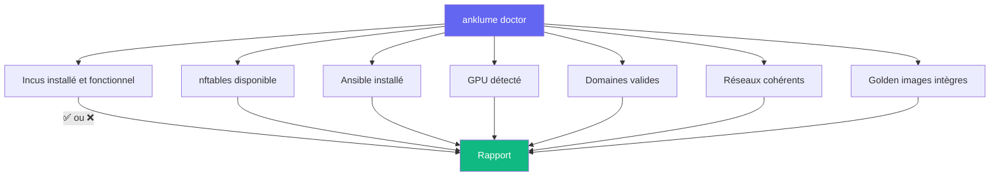

# Diagnostic — `anklume doctor`

Diagnostic automatique de l'environnement avec corrections optionnelles.

## Commandes

```bash
# Diagnostic
anklume doctor

# Diagnostic + corrections automatiques
anklume doctor --fix

# Sortie JSON
anklume doctor --json
```

## Checks effectués



| Check | Description | `--fix` |
|---|---|---|
| Incus | Installation et accès | — |
| nftables | Présence de `nft` | — |
| Ansible | Installation | — |
| GPU | Détection `nvidia-smi` | — |
| Domaines | Validation des fichiers YAML | — |
| Réseaux | Cohérence bridges vs domaines | Crée les bridges manquants |
| Golden images | Intégrité des images publiées | Nettoie les images orphelines |
