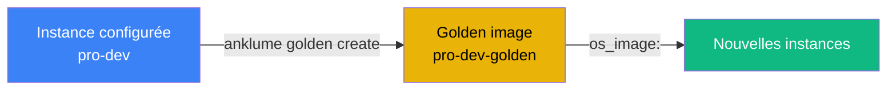

# Golden images

Publier des instances configurées comme images réutilisables.

## Principe



## Commandes

```bash
# Publier une instance comme image
anklume golden create pro-dev
anklume golden create pro-dev --alias mon-image-dev

# Lister les golden images
anklume golden list

# Supprimer une golden image
anklume golden delete mon-image-dev
```

## Usage

Une fois créée, la golden image peut être utilisée comme `os_image`
dans un fichier domaine :

```yaml
machines:
  dev-clone:
    description: "Clone de l'environnement de dev"
    type: lxc
    os_image: mon-image-dev
```
