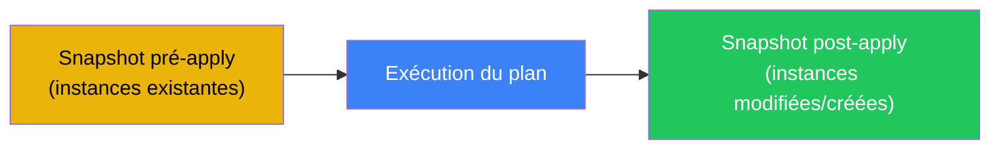

# Snapshots

## Snapshots automatiques

anklume crée automatiquement des snapshots lors de `anklume apply` :



### Nommage

Format automatique : `anklume-{pre|post}-{YYYYMMDD-HHMMSS}`

## Commandes

```bash
# Snapshotter toutes les instances
anklume snapshot create

# Snapshotter une instance
anklume snapshot create pro-dev

# Snapshot avec nom personnalisé
anklume snapshot create pro-dev --name avant-migration

# Lister les snapshots
anklume snapshot list
anklume snapshot list pro-dev

# Restaurer un snapshot
anklume snapshot restore pro-dev anklume-pre-20240301-120000

# Supprimer un snapshot
anklume snapshot delete pro-dev anklume-pre-20240301-120000

# Rollback destructif (restaure + supprime les snapshots postérieurs)
anklume snapshot rollback pro-dev anklume-pre-20240301-120000
```

## Rollback destructif

`rollback` restaure un snapshot et **supprime tous les snapshots
postérieurs**. Utile pour revenir à un état connu et nettoyer
l'historique.


## Protection ephemeral

Les instances avec `ephemeral: false` (défaut) ont
`security.protection.delete=true`. Les snapshots respectent
cette protection.
