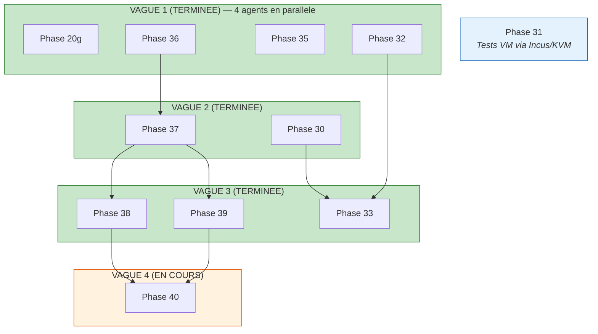

> La version anglaise fait foi en cas de divergence.

# Plan d'execution autonome nocturne

Plan directeur pour implementer toutes les phases restantes du ROADMAP
avec un parallelisme maximal. Claude travaille la nuit, l'utilisateur
relit `DECISIONS.md` le lendemain matin.

## Graphe de dependances

## Vague 1 — TERMINEE

| Agent | Phase | Branche | Statut |
|-------|-------|---------|--------|
| a094b57f | 20g Donnees persistantes | feat/persistent-data | Fusionnee |
| a11d4e14 | 32 UX Makefile | feat/makefile-ux | Fusionnee |
| a984299c | 35 Workflow dev | feat/dev-workflow-simplify | Fusionnee |
| a61669d1 | 36 Convention de nommage | feat/naming-convention | Fusionnee |

**Resultat** : Les 4 branches fusionnees dans main. 3343 tests passants,
linters propres. DECISIONS.md consolide. Worktrees nettoyees.

## Vague 2 — TERMINEE

| Agent | Phase | Branche | Statut |
|-------|-------|---------|--------|
| af143511 | 37 OpenClaw par domaine | worktree-agent-af143511 | Fusionnee |
| ac2e3feb | 30 Labs pedagogiques | worktree-agent-ac2e3feb | Fusionnee |

**Resultat** : Les deux branches fusionnees dans main. 3422 tests passants.
DECISIONS.md consolide. Worktrees nettoyees.

## Vague 3 — TERMINEE

| Agent | Phase | Branche | Statut |
|-------|-------|---------|--------|
| a406ee2e | 38 Heartbeat | worktree-agent-a406ee2e | Fusionnee |
| a6b01915 | 39 Assainisseur LLM | worktree-agent-a6b01915 | Fusionnee |
| a23ea2c5 | 33 Mode etudiant | worktree-agent-a23ea2c5 | Fusionnee |

**Resultat** : Les 3 branches fusionnees dans main. 3558 tests passants.
Resolution de conflits : fusion des valeurs par defaut openclaw_server
(conscience du domaine Phase 37 + variables heartbeat Phase 38), generateur
(validation openclaw + assainisseur), SPEC (les deux jeux de champs),
ARCHITECTURE (ADR-043 + ADR-044). Correctifs post-fusion : meta/molecule
llm_sanitizer, renommage prefixe SAN->LS.

## Vague 4 — EN COURS

| Agent | Phase | Branche | Statut |
|-------|-------|---------|--------|
| afb53c8f | 40 Inspection reseau | worktree-agent-afb53c8f | En cours |

**Perimetre** :
- Skills personnalises : `anklume-network-triage`, `anklume-inventory-diff`,
  `anklume-pcap-summary`
- Script de diff de scan nmap
- Motifs d'anonymisation specifiques au reseau
- Doc : docs/network-inspection.md
- Tests : NI-001 a NI-005

## Phases necessitant un environnement specifique

### Phase 31 : Live OS
**Raison** : Necessite une VM Incus/KVM pour les tests de demarrage, UEFI,
creation de pools ZFS/BTRFS chiffres. Testable localement via `anklume live test`.
**Statut** : Support de base Arch Linux verifie, 11 criteres sur 12 restants.

## Bilan final

| Vague | Phases | Tests ajoutes | Total tests |
|-------|--------|---------------|-------------|
| 1 | 20g, 32, 35, 36 | ~200 | 3343 |
| 2 | 37, 30 | ~80 | 3422 |
| 3 | 38, 39, 33 | ~136 | 3558 |
| 4 | 40 | ~A determiner | ~3600+ |
